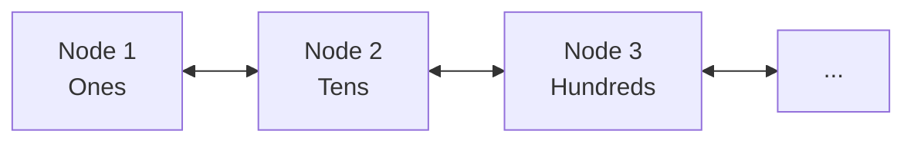
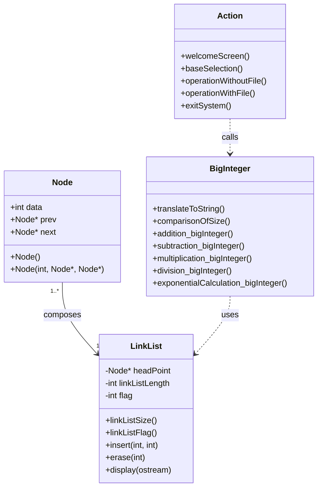

# Big Integer Arithmetic System

> A high-precision big integer arithmetic library implemented in C++, supporting various arithmetic operations in both decimal and binary systems

[中文](README.md) | English

---

## Table of Contents

- [Overview](#overview)
- [Features](#features)
- [Architecture](#architecture)
- [Building](#building)
- [Usage](#usage)
- [Project Structure](#project-structure)
- [Algorithms](#algorithms)
- [Development Info](#development-info)

---

## Overview

This project is a Data Structures course assignment that implements a big integer arithmetic system based on doubly linked lists. The system can handle integers beyond the range of standard data types (such as `int` and `long long`), supporting addition, subtraction, multiplication, division, and exponentiation in both decimal and binary systems, with a user-friendly command-line interface.

### Use Cases

- Learning and teaching large number arithmetic
- Data structures course design reference
- Cryptography algorithm research
- High-precision computing applications

---

## Features

### Supported Operations

| Operation | Decimal | Binary | Notes |
|-----------|---------|--------|-------|
| Addition (+) | ✅ | ✅ | Supports signed numbers |
| Subtraction (-) | ✅ | ✅ | Supports signed numbers |
| Multiplication (*) | ✅ | ✅ | Supports signed numbers |
| Division (/) | ✅ | ✅ | Integer division, supports signed numbers |
| Exponentiation (^) | ✅ | ✅ | Power operation |

### Input Methods

- **Interactive Input**: Enter operands directly via command line
- **File Input**: Read operands from specified files

### Additional Features

- Signed number arithmetic
- Automatic carry and borrow handling
- Results can be written to output files
- Interactive command-line interface

---

## Architecture

### Data Structure Design

Big integers are stored using doubly linked lists, with each node storing one digit:



List direction: **Low order → High order**

### Class Design



### Module Description

| File | Description |
|------|-------------|
| `Node.h` | Linked list node definition with data field and prev/next pointers |
| `LinkList.h/cpp` | Doubly linked list implementation providing insert, delete, traverse operations |
| `BigInteger.h/cpp` | Core big integer arithmetic algorithm implementation |
| `Action.h/cpp` | User interface and interaction logic |
| `main.cpp` | Program entry point |

---

## Building

### Requirements

- **Compiler**: GCC/Clang/MSVC with C++11 or later support
- **Operating System**: Windows / macOS / Linux

### Compile Commands

```bash
# Using g++
g++ main.cpp Action.cpp BigInteger.cpp LinkList.cpp -o biginteger

# Using clang++
clang++ main.cpp Action.cpp BigInteger.cpp LinkList.cpp -o biginteger
```

### Run the Program

```bash
# Linux/macOS
./biginteger

# Windows
biginteger.exe
```

---

## Usage

### Main Menu

After launching, the program displays a welcome screen and enters the main menu:

```
请选择
1.不涉及文件的大整数运算
2.涉及文件的大整数运算
3.退出系统
请选择：
```

### Operations Without File

Select **1**, then choose the number base:

```
请选择:
1.十进制
2.二进制
请选择：
```

Then select the operation type:

```
请按1,2,3,4,5选择运算
1.加法
2.减法
3.乘法
4.除法
5.指数
6.退出
请选择：
```

#### Interactive Input Example

```
请输入第一个大整数：
12345678901234567890
请输入第二个大整数：
98765432109876543210

list1:12345678901234567890
list2:98765432109876543210
加法  >>> (list1 + list2) = 111111111011111111100
```

### Operations With File

Select **2**, the program will read input files from the `file/` directory.

#### File Format

**Decimal input file** (`file/file_decimalSystem.txt`):
```
1           // Operation type: 1=+, 2=-, 3=*, 4=/, 5=^
999999999999  // First operand
321          // Second operand
```

**Binary input file** (`file/file_binarySystem.txt`):
```
1           // Operation type
10111101    // First operand (binary)
1111        // Second operand (binary)
```

#### Output Files

Results are automatically written to:
- `file/result_decimalSystem.txt` - Decimal operation results
- `file/result_binarySystem.txt` - Binary operation results

---

## Project Structure

```
big-integer-arithmetic/
├── main.cpp              # Program entry point
├── Action.h / Action.cpp # User interaction interface
├── BigInteger.h / BigInteger.cpp  # Core big integer arithmetic
├── LinkList.h / LinkList.cpp      # Doubly linked list implementation
├── Node.h                # Linked list node definition
├── file/                 # Input/output files directory
│   ├── file_decimalSystem.txt     # Decimal input file
│   ├── file_binarySystem.txt      # Binary input file
│   ├── result_decimalSystem.txt   # Decimal output file
│   └── result_binarySystem.txt    # Binary output file
├── README.md             # Chinese version
└── README.en.md          # This file (English)
```

---

## Algorithms

### Addition Algorithm

1. Traverse from the head of the list (lowest order digit)
2. Add corresponding digits, record carry
3. Handle signs: add for same sign, subtract for different signs
4. Process final carry

### Subtraction Algorithm

1. Compare the sizes of two numbers
2. Subtract digit by digit from low order
3. Handle borrowing
4. Determine result sign

### Multiplication Algorithm

Uses the vertical multiplication algorithm:
1. Multiply each digit of the multiplier with the multiplicand
2. Handle carries
3. Add partial results with proper offset

### Division Algorithm

Uses the long division algorithm:
1. Compare dividend and divisor sizes
2. Trial quotient from high order digits
3. Accumulate subtraction to get quotient
4. Handle sign

### Exponentiation Algorithm

Uses the fast exponentiation algorithm:
1. Convert exponent to binary
2. Calculate power digit by digit
3. Handle sign (reciprocal for negative exponent)

---

## Development Info

### Author Information

- **Author**: Donghui Zheng
- **Class**: Data Science and Big Data Technology Class 1901
- **Student ID**: 201906062631

### Development Timeline

- **Created**: December 2020
- **Last Updated**: January 2021

### Project Background

This software is a course design assignment for the Data Structures course. The goal is to deeply understand and apply linked list data structures by implementing a big integer arithmetic system, while mastering the algorithmic principles of high-precision arithmetic.

---

## License

This project is for learning and reference purposes only.

---

## FAQ

**Q: How large of an integer is supported?**
A: Theoretically only limited by memory, can handle integers of arbitrary length.

**Q: How to handle negative numbers?**
A: Simply add a `-` sign before the number when inputting, such as `-123`.

**Q: Are binary operation results in binary?**
A: Yes, when binary mode is selected, both input and output are in binary format.

**Q: Can it compile and run on Linux/macOS?**
A: Yes, but `system("cls")` needs to be changed to `system("clear")`.

---

*If you have any questions or suggestions, feel free to submit an Issue or Pull Request*
