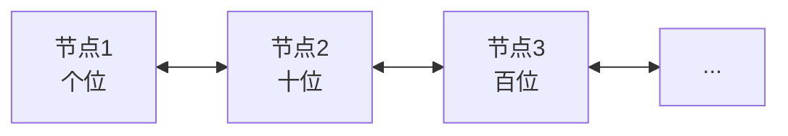
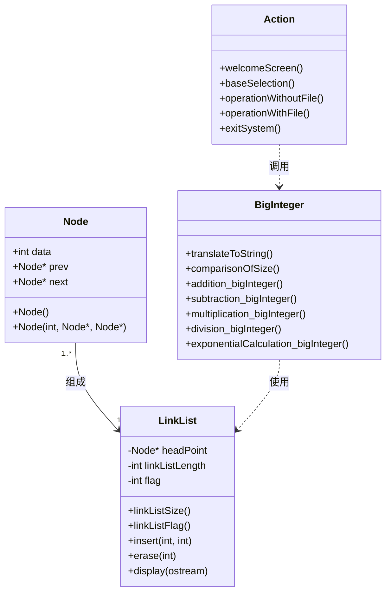

# 大整数运算系统

> 一个用 C++ 实现的高精度大整数运算库，支持十进制和二进制的多种算术运算

中文 | [English](README.en.md)

## 目录

- [项目简介](#项目简介)
- [功能特性](#功能特性)
- [技术架构](#技术架构)
- [编译运行](#编译运行)
- [使用指南](#使用指南)
- [文件说明](#文件说明)
- [算法原理](#算法原理)
- [开发信息](#开发信息)

---

## 项目简介

本项目是一个数据结构课程设计，实现了基于双向链表的大整数运算系统。系统可以处理超出标准数据类型（如 `int`、`long long`）表示范围的大整数，支持十进制和二进制下的加、减、乘、除、指数运算，并提供友好的命令行交互界面。

### 适用场景

- 大数运算学习与教学
- 数据结构课程设计参考
- 加密算法基础研究
- 高精度计算应用

---

## 功能特性

### 支持的运算

| 运算类型 | 十进制 | 二进制 | 说明 |
|---------|-------|-------|------|
| 加法 (+) | ✅ | ✅ | 支持正负数 |
| 减法 (-) | ✅ | ✅ | 支持正负数 |
| 乘法 (*) | ✅ | ✅ | 支持正负数 |
| 除法 (/) | ✅ | ✅ | 整数除法，支持正负数 |
| 指数 (^) | ✅ | ✅ | 幂运算 |

### 输入方式

- **交互式输入**：通过命令行直接输入操作数
- **文件输入**：从指定文件读取操作数

### 其他特性

- 支持正负数运算
- 自动处理进位和借位
- 运算结果可输出到文件
- 友好的中文交互界面

---

## 技术架构

### 数据结构设计

大整数使用双向链表存储，每个节点存储一位数字：



链表方向：**低位 → 高位**

### 类设计



### 模块说明

| 文件 | 功能描述 |
|-----|---------|
| `Node.h` | 链表节点定义，包含数据域和前驱/后继指针 |
| `LinkList.h/cpp` | 双向链表实现，提供插入、删除、遍历等操作 |
| `BigInteger.h/cpp` | 大整数运算核心算法实现 |
| `Action.h/cpp` | 用户界面和交互逻辑 |
| `main.cpp` | 程序入口 |

---

## 编译运行

### 环境要求

- **编译器**：支持 C++11 或更高版本的 GCC/Clang/MSVC
- **操作系统**：Windows / macOS / Linux

### 编译命令

```bash
# 使用 g++
g++ main.cpp Action.cpp BigInteger.cpp LinkList.cpp -o biginteger

# 使用 clang++
clang++ main.cpp Action.cpp BigInteger.cpp LinkList.cpp -o biginteger
```

### 运行程序

```bash
# Linux/macOS
./biginteger

# Windows
biginteger.exe
```

---

## 使用指南

### 主菜单

程序启动后显示欢迎界面，然后进入主菜单：

```
请选择
1.不涉及文件的大整数运算
2.涉及文件的大整数运算
3.退出系统
请选择：
```

### 不涉及文件的运算

选择 **1** 后，首先选择进制：

```
请选择:
1.十进制
2.二进制
请选择：
```

然后选择运算类型：

```
请按1,2,3,4,5选择运算
1.加法
2.减法
3.乘法
4.除法
5.指数
6.退出
请选择：
```

#### 交互式输入示例

```
请输入第一个大整数：
12345678901234567890
请输入第二个大整数：
98765432109876543210

list1:12345678901234567890
list2:98765432109876543210
加法  >>> (list1 + list2) = 111111111011111111100
```

### 涉及文件的运算

选择 **2** 后，程序会从 `file/` 目录读取输入文件。

#### 文件格式

**十进制输入文件** (`file/file_decimalSystem.txt`)：
```
1           // 运算类型：1=+, 2=-, 3=*, 4=/, 5=^
999999999999  // 第一个操作数
321          // 第二个操作数
```

**二进制输入文件** (`file/file_binarySystem.txt`)：
```
1           // 运算类型
10111101    // 第一个操作数（二进制）
1111        // 第二个操作数（二进制）
```

#### 输出文件

运算结果会自动写入以下文件：
- `file/result_decimalSystem.txt` - 十进制运算结果
- `file/result_binarySystem.txt` - 二进制运算结果

---

## 文件说明

```
big-integer-arithmetic/
├── main.cpp              # 程序入口
├── Action.h / Action.cpp # 用户交互界面
├── BigInteger.h / BigInteger.cpp  # 大整数运算核心
├── LinkList.h / LinkList.cpp      # 双向链表实现
├── Node.h                # 链表节点定义
├── file/                 # 输入输出文件目录
│   ├── file_decimalSystem.txt     # 十进制输入文件
│   ├── file_binarySystem.txt      # 二进制输入文件
│   ├── result_decimalSystem.txt   # 十进制输出文件
│   └── result_binarySystem.txt    # 二进制输出文件
├── README.md             # 本文档（中文版）
└── README.en.md          # 英文版文档
```

---

## 算法原理

### 加法运算

1. 从链表头部（最低位）开始遍历
2. 对应位相加，记录进位
3. 处理符号：同号相加，异号相减
4. 处理最高位进位

### 减法运算

1. 比较两个数的大小
2. 从低位开始逐位相减
3. 处理借位
4. 确定结果符号

### 乘法运算

采用竖式乘法算法：
1. 用乘数的每一位乘以被乘数
2. 处理进位
3. 将部分结果错位相加

### 除法运算

采用长除法算法：
1. 比较被除数和除数大小
2. 从高位开始试商
3. 累减得到商
4. 处理符号

### 指数运算

采用快速幂算法：
1. 将指数转换为二进制
2. 逐位计算幂次
3. 处理符号（负指数取倒数）

---

## 开发信息

### 作者信息

- **作者**：郑东辉
- **班级**：数据科学与大数据技术 1901 班
- **学号**：201906062631

### 开发时间

- **创建日期**：2020年12月
- **最后更新**：2021年1月

### 项目背景

本软件是数据结构课程的课程设计作业，旨在通过实现大整数运算系统，深入理解和应用链表数据结构，同时掌握高精度运算的算法原理。

---

## 许可证

本项目仅供学习参考使用。

---

## 常见问题

**Q: 支持多大的整数？**
A: 理论上仅受内存限制，可以处理任意长度的整数。

**Q: 如何处理负数？**
A: 输入时直接在数字前加 `-` 号即可，如 `-123`。

**Q: 二进制运算结果是二进制吗？**
A: 是的，选择二进制模式后，输入和输出均为二进制格式。

**Q: 可以在 Linux/macOS 上编译运行吗？**
A: 可以，但 `system("cls")` 需要改为 `system("clear")`。

---

*如有问题或建议，欢迎提出 Issue 或 Pull Request*
